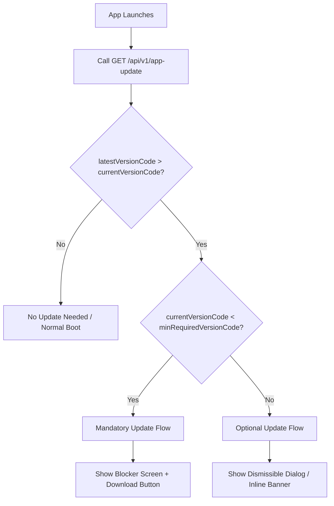

# Architecture Design: APK Over-The-Air (OTA) Update System

This document outlines a scalable, production-ready design for checking, validating, and applying OTA updates for an Android application distributed via direct APK downloads outside the Google Play Store.

---

## 1. Versioning Strategy: SemVer vs. Version Code

In production Android development, **two** numbers represent the version of the application:
1. **Version Name (`versionName`)**: A user-facing string (e.g., `1.2.5`).
2. **Version Code (`versionCode`)**: A positive, monotonically increasing integer (e.g., `10205`).

> [!IMPORTANT]
> **Use the Version Code (`versionCode`) for comparison logic, not the Version Name.** 
> While Semantic Versioning (SemVer) is excellent for communicating changes to users and developers, parsing and comparing string arrays (e.g., splitting by `.` and doing integer comparisons) is error-prone. Comparing simple integers is bulletproof.

### Recommended Version Code Mapping
Map your SemVer (`major.minor.patch`) to a padded integer `versionCode` so that semantic hierarchy is preserved:
$$\text{versionCode} = (\text{major} \times 1000000) + (\text{minor} \times 10000) + (\text{patch} \times 100)$$

* **SemVer `1.0.0`** $\rightarrow$ `1000000`
* **SemVer `1.0.1`** $\rightarrow$ `1000100`
* **SemVer `2.15.3`** $\rightarrow$ `2150300`

This approach ensures that `2.15.3` (`2150300`) is numerically greater than `1.0.0` (`1000000`) and resolves all version comparison logic to a simple mathematical check: `latestVersionCode > currentVersionCode`.

---

## 2. API Design & Database Schema

### API Response Structure (`GET /api/v1/app-update`)
To support flexible (optional) vs. immediate (mandatory) updates, the client must know not only the latest version, but also the **minimum supported version** to operate.

#### Request Headers
The client should send its current version in request headers or query parameters:
* `X-App-Version-Code: 1000100`
* `X-App-Platform: android`

#### Response Payload
```json
{
  "latestVersion": {
    "versionCode": 1000200,
    "versionName": "1.0.2",
    "releaseNotes": "Critical bug fix for authentication timeout and UI improvements.",
    "apkUrl": "https://github.com/org/repo/releases/download/v1.0.2/app-release.apk",
    "sha256": "e3b0c44298fc1c149afbf4c8996fb92427ae41e4649b934ca495991b7852b855"
  },
  "minRequiredVersionCode": 1000200,
  "flexibleUpdateAllowed": true
}
```

### Database Schema
A normalized schema to store releases and configure update rules:

```sql
CREATE TABLE app_releases (
    id SERIAL PRIMARY KEY,
    version_code INT UNIQUE NOT NULL,
    version_name VARCHAR(50) NOT NULL,
    platform VARCHAR(20) DEFAULT 'android',
    apk_url TEXT NOT NULL,
    sha256 VARCHAR(64) NOT NULL,
    release_notes TEXT,
    min_required_version_code INT NOT NULL,
    is_active BOOLEAN DEFAULT TRUE,
    created_at TIMESTAMP DEFAULT CURRENT_TIMESTAMP
);
```

---

## 3. Optional vs. Mandatory Update Logic

By returning `minRequiredVersionCode` and comparing it to the client's version, you can classify the update state into three tiers:



### Update Tiers
1. **No Update**: `latestVersionCode <= currentVersionCode`.
2. **Optional (Flexible) Update**: `latestVersionCode > currentVersionCode` AND `currentVersionCode >= minRequiredVersionCode`.
   * *UI Treatment*: Show a dismissible banner or dialog offering the update. Allow the user to skip the version.
3. **Mandatory (Immediate) Update**: `latestVersionCode > currentVersionCode` AND `currentVersionCode < minRequiredVersionCode`.
   * *UI Treatment*: Block the application interface completely with a non-dismissible dialog directing the user to download and install the new APK.

---

## 4. Automating Updates via GitHub Actions

Manually writing to a production database is risky and tedious. Since you already use GitHub Actions, you can **automate** the metadata publish process directly within the build pipeline.

### GitHub Actions Workflow Integration
1. The developer pushes code to `main` (or creates a Git Tag `v1.0.2`).
2. The workflow builds the APK.
3. The workflow signs the APK and uploads it to GitHub Releases.
4. **Automation Step**: The workflow fires a POST request to your backend admin endpoint to register the new release.

```yaml
- name: Publish Metadata to Update Server
  run: |
    curl -X POST https://api.yourdomain.com/admin/releases \
      -H "Authorization: Bearer ${{ secrets.UPDATE_SERVER_API_KEY }}" \
      -H "Content-Type: application/json" \
      -d '{
        "versionCode": ${{ github.event.inputs.version_code }},
        "versionName": "${{ github.ref_name }}",
        "apkUrl": "https://github.com/owner/repo/releases/download/${{ github.ref_name }}/app-release.apk",
        "minRequiredVersionCode": ${{ github.event.inputs.min_version_code }}
      }'
```

### Static Alternative (No Database / Zero Server Cost)
If you want to keep it simple, you don't even need a database or an active backend server. You can host a static JSON file (`update-config.json`) on **GitHub Pages** or **AWS S3**.
* GitHub Actions updates the JSON file in the repository and commits it.
* The app calls `GET https://raw.githubusercontent.com/owner/repo/main/update-config.json`.
* This eliminates server management, scaling issues, and database maintenance entirely.

---

## 5. Edge Cases & Production Best Practices

### 1. Verification and Integrity
* **SHA-256 Checksum**: When downloading the APK, calculate the SHA-256 hash of the downloaded file and verify it matches the API response's `sha256` value before starting the installation. This prevents corrupted downloads and man-in-the-middle attacks.

### 2. The Skip (Snooze) Feature
* If an update is optional, allow the user to select "Skip this version". Store the skipped `versionCode` in Android's `SharedPreferences` (or Local Storage). Do not prompt the user again until `latestVersionCode` increases past the skipped version.

### 3. Graceful Rollbacks (Downgrades)
* If a bug escapes to production, you may need to force a downgrade.
* If `latestVersionCode < currentVersionCode` and the update server returns `forceDowngrade: true`, wipe the local DB/cache and launch the APK install intent for the older version to get users back onto a stable release.

### 4. API / Schema Version Lock (Incompatibilities)
* If you make a breaking change to your backend API, all previous client versions will crash.
* When executing a breaking change, configure the update server's `minRequiredVersionCode` for the new release to match the version containing the updated API client. Older apps will immediately block users and force them to get the functional app.

### 5. Seamless Installation Experience
To install the APK programmatically, use Android's `FileProvider` and launch the install intent:

```kotlin
val apkFile = File(context.cacheDir, "app-update.apk")
val apkUri = FileProvider.getUriForFile(context, "${context.packageName}.fileprovider", apkFile)

val intent = Intent(Intent.ACTION_VIEW).apply {
    setDataAndType(apkUri, "application/vnd.android.package-archive")
    addFlags(Intent.FLAG_GRANT_READ_URI_PERMISSION)
    addFlags(Intent.FLAG_ACTIVITY_NEW_TASK)
}
context.startActivity(intent)
```

> [!NOTE]
> On Android 8.0 (API level 26) and higher, the app must declare the `<uses-permission android:name="android.permission.REQUEST_INSTALL_PACKAGES" />` permission in its `AndroidManifest.xml` to allow direct installations.
