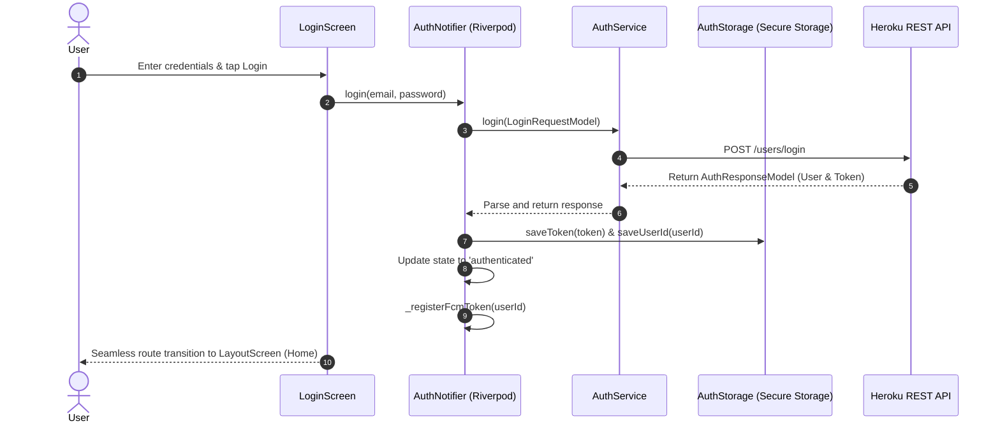
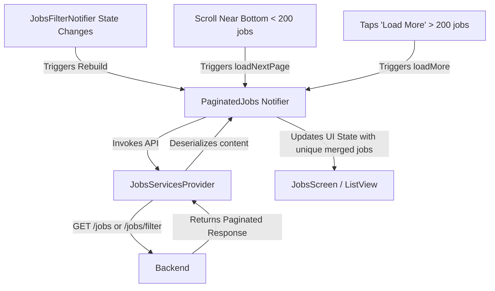
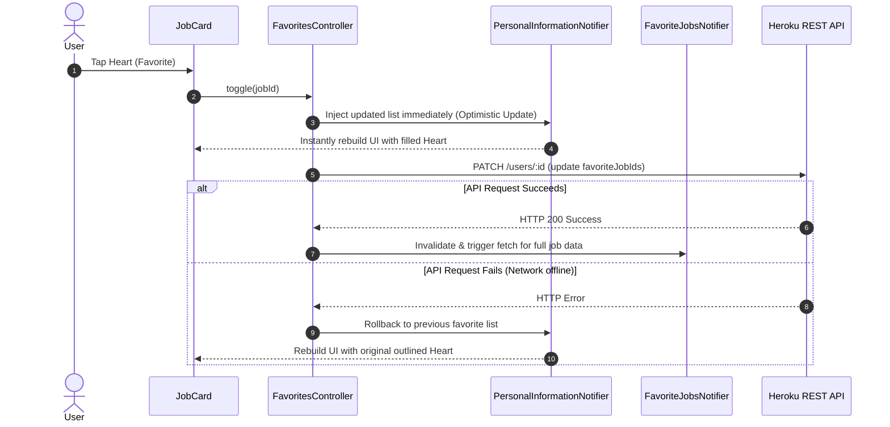
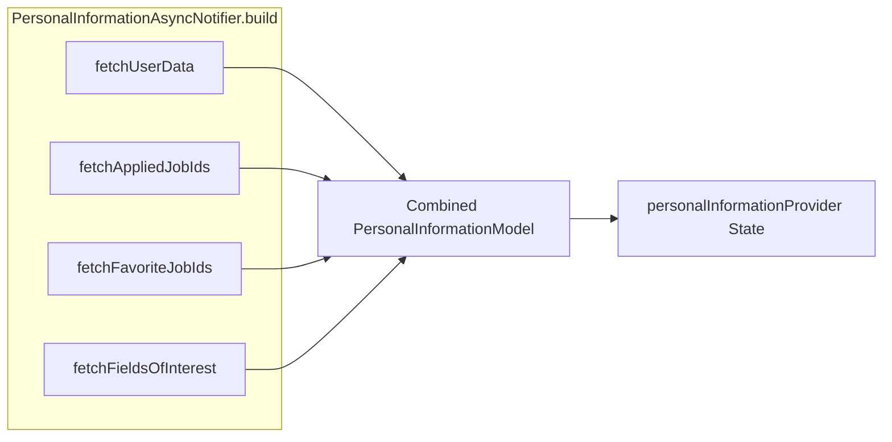
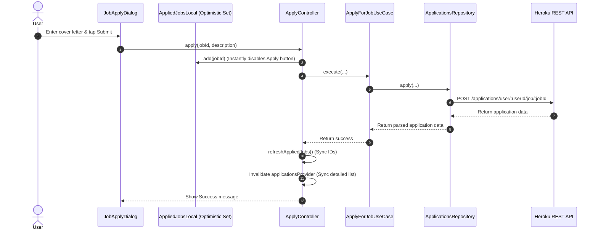

# Seasonal Job Matching Platform - Codebase Architecture & Feature Interaction Guide

Welcome to the definitive architectural and interaction guide for the **Seasonal Job Matching Platform Mobile Application**. This document is designed to give developers, architects, and stakeholders a deep, comprehensive understanding of how the different components, services, and state providers interact to form a cohesive, performant, and secure application.

---

## 1. High-Level Architectural Layers

The application is structured using a hybrid approach blending **Clean Architecture** (separating Domain/Data/Presentation) and **Feature-by-Folder/Feature-by-Screen** organization. State management is reactively governed by **Flutter Riverpod**, with network communications routed through **Dio**.

Below is a visualization of how data and control flow across the various architectural layers:

```mermaid
graph TD
    subgraph Presentation Layer [Presentation Layer (UI)]
        A[Screens & Views] -->|watches| B[Riverpod Notifiers & Providers]
        A -->|triggers actions| B
        C[Reusable Common Widgets] -->|UI rendering| A
    end

    subgraph Domain Layer [Domain Layer (Business Logic)]
        B -->|executes| D[Use Cases]
    end

    subgraph Data Layer [Data Layer (State & Storage)]
        D -->|delegates to| E[Repositories]
        B -->|uses| F[Services]
        E -->|uses| G[Network Client (Dio)]
        F -->|uses| G
        H[Secure Storage] <-->|manages tokens/sessions| B
    end

    subgraph External Services [External Infrastructure]
        G -->|REST APIs| I[Heroku / Backend]
        J[Firebase Cloud Messaging] -->|Push Notifications| K[Notification Service]
        K -->|notifies| B
    end
    
    style Presentation Layer fill:#e8f0fe,stroke:#4285f4,stroke-width:2px
    style Domain Layer fill:#e6f4ea,stroke:#34a853,stroke-width:2px
    style Data Layer fill:#fef7e0,stroke:#fbbc05,stroke-width:2px
    style External Services fill:#fce8e6,stroke:#ea4335,stroke-width:2px
```

---

## 2. Core Feature-by-Feature Interactions

Let's dissect each functional module of the app, explaining exactly **How It Works**, **How It Is Done (Implementation Flow)**, the **Precise Files Associated**, and **Cross-Feature Interactions**.

---

### A. Authentication & Session Management

#### 1. How It Works
The authentication system secures user access. It manages user registration, login, persistence of credentials across app restarts, automatic token interception on outgoing API requests, and graceful recovery when sessions expire.

#### 2. How It Is Done
- **Initialization**: On startup, `main.dart` renders a `SplashWrapper`. This wrapper listens to `authProvider`. If a valid token exists in secure storage, the user is seamlessly routed to the `LayoutScreen`; otherwise, they are shown the `LoginScreen`.
- **Interception**: The network layer injects an `AuthInterceptor` into Dio. This interceptor automatically pulls the stored token from `AuthStorage` and adds it to the HTTP headers of every outgoing request.
- **Session Expiration**: If the backend returns a `401 Unauthorized` or `403 Forbidden` response for a protected endpoint, a custom Dio `InterceptorsWrapper` catches the error. It clears the local storage, triggers an invalidation of all Riverpod providers (erasing user data from memory), and marks the state as unauthenticated with `sessionExpired: true`. The `LayoutScreen` catches this state change and prompts the user with a session expired dialog before routing them back to the login screen.



#### 3. Precise Files Associated
- 📱 **Screens**: 
  - [login_screen.dart](file:///d:/Projects/Seasonal-job-matching-platform-mobile/lib/screens/auth/login_screen.dart) — Captures credentials, validates inputs, and triggers the login flow.
  - [signup_screen.dart](file:///d:/Projects/Seasonal-job-matching-platform-mobile/lib/screens/auth/signup_screen.dart) — Handles registration.
- ⚙️ **Services & Storage**: 
  - [auth_service.dart](file:///d:/Projects/Seasonal-job-matching-platform-mobile/lib/services/auth_service.dart) — Executes login, signup, and logout API requests using the configured Dio client.
  - [auth_storage.dart](file:///d:/Projects/Seasonal-job-matching-platform-mobile/lib/core/auth/auth_storage.dart) — Securely saves and reads the JWT auth token, User ID, and FCM tokens.
- 🔄 **State Management**: 
  - [auth_provider.dart](file:///d:/Projects/Seasonal-job-matching-platform-mobile/lib/providers/auth_provider.dart) — Governs `AuthState` and `AuthNotifier`. It handles session check, login/signup orchestrations, token registration, and invalidates all providers on logout to prevent memory leaks.
- 🛠️ **Interceptors**: 
  - [auth_interceptor.dart](file:///d:/Projects/Seasonal-job-matching-platform-mobile/lib/core/auth/auth_interceptor.dart) — Appends authorization headers.
  - [auth_dialog_manager.dart](file:///d:/Projects/Seasonal-job-matching-platform-mobile/lib/core/auth/auth_dialog_manager.dart) — Tracks session expiration state to prevent multiple alert dialogs.
- 📦 **Models**: 
  - [login_request_model.dart](file:///d:/Projects/Seasonal-job-matching-platform-mobile/lib/models/auth_models/login_request_model.dart), [signup_request_model.dart](file:///d:/Projects/Seasonal-job-matching-platform-mobile/lib/models/auth_models/signup_request_model.dart), [auth_response_model.dart](file:///d:/Projects/Seasonal-job-matching-platform-mobile/lib/models/auth_models/auth_response_model.dart) — Immutable data models generated via Freezed.

#### 4. Cross-Feature Interactions
- **State Invalidation**: Upon logout, `AuthNotifier` explicitly invalidates **13 separate data providers** (including `personalInformationProvider`, `paginatedJobsProvider`, `favoriteJobsProvider`, etc.) to guarantee that no user-specific data remains in memory.
- **Push Notification Integration**: On successful login or signup, `AuthNotifier` fetches the Firebase Cloud Messaging token and registers it with the backend via `NotificationsApiService`.

---

### B. Job Search, Discovery & Paginated Listings

#### 1. How It Works
This feature allows users to search, browse, and filter jobs with premium visual effects (dimming viewed cards) and performance optimization (infinite scroll pagination).

#### 2. How It Is Done
- **Pagination Strategy**: The application uses a hybrid pagination scheme. For the first **200 jobs** (4 pages of 50 elements each), the app automatically fetches the next page when the user scrolls near the bottom of the list. Beyond 200 jobs, infinite scroll stops and a manual "Load More" button is rendered in the footer to conserve device memory and prevent excessive network usage.
- **Server-Side Filtering**: The filter state is managed by `JobsFilterNotifier`. When a user types a search query or selects filter criteria (job types, locations, salary types), the `JobsFilterNotifier` updates its state. The `PaginatedJobs` notifier watches `jobsFilterProvider`. Any change in the filter state automatically invalidates the job list, resets pagination to page 0, and loads filtered jobs from `/jobs/filter` instead of `/jobs`.
- **View Tracking**: When a user taps a job card, the `markJobAsViewed` method is called to append the job's ID to a `viewedJobIds` set. This set is preserved in memory during the session, and job cards matching these IDs are visually dimmed (rendered with reduced opacity) to provide outstanding visual feedback.



#### 3. Precise Files Associated
- 📱 **Screens**: 
  - [jobs_screen.dart](file:///d:/Projects/Seasonal-job-matching-platform-mobile/lib/screens/jobs_screen.dart) — A simple screen hosting the main job section.
- ⚙️ **Services**: 
  - [jobs_services_provider.dart](file:///d:/Projects/Seasonal-job-matching-platform-mobile/lib/services/jobs_screen_services/jobs_services_provider.dart) — Contains the Dio calls for fetching basic job lists, paginated jobs, and executing search/filter queries.
- 🔄 **State Management**: 
  - [paginated_jobs_provider.dart](file:///d:/Projects/Seasonal-job-matching-platform-mobile/lib/providers/jobs_screen_providers/paginated_jobs_provider.dart) — Governs `PaginatedJobsState`. Handles automatic vs. manual pagination, eliminates duplicates, and tracks viewed job IDs.
  - [jobs_filter_provider.dart](file:///d:/Projects/Seasonal-job-matching-platform-mobile/lib/providers/jobs_screen_providers/jobs_filter_provider.dart) — Manages mutable filter selections (search terms, salary type, location, job type).
  - [job_notifier.dart](file:///d:/Projects/Seasonal-job-matching-platform-mobile/lib/providers/jobs_screen_providers/job_notifier.dart) — Parametric notifier to load a single job's detail state.
- 🎨 **Widgets**: 
  - [job_card.dart](file:///d:/Projects/Seasonal-job-matching-platform-mobile/lib/widgets/jobs_screen_widgets/job_card.dart) — The premium card UI. Features tap scale animations, "New" badge (for jobs posted within 7 days), and opacity dimming for viewed items.
  - [job_crad_section.dart](file:///d:/Projects/Seasonal-job-matching-platform-mobile/lib/widgets/jobs_screen_widgets/job_crad_section.dart) — Houses the scroll controller, listens to scroll position, and triggers page loads.
  - [jobs_search_header.dart](file:///d:/Projects/Seasonal-job-matching-platform-mobile/lib/widgets/jobs_screen_widgets/jobs_search_header.dart) — Interactive filter interface supporting custom bottom-sheet filter selectors.
  - [jobs_pagination_footer.dart](file:///d:/Projects/Seasonal-job-matching-platform-mobile/lib/widgets/jobs_screen_widgets/jobs_pagination_footer.dart) — Renders loading shimmers or the "Load More" button.
- 📦 **Models**: 
  - [job_model.dart](file:///d:/Projects/Seasonal-job-matching-platform-mobile/lib/models/jobs_screen_models/job_model.dart), [paginated_jobs_response.dart](file:///d:/Projects/Seasonal-job-matching-platform-mobile/lib/models/jobs_screen_models/paginated_jobs_response.dart) — Parsed immutable models.

#### 4. Cross-Feature Interactions
- **View Sync**: Tapping on a job card opens `JobView` ([job_view.dart](file:///d:/Projects/Seasonal-job-matching-platform-mobile/lib/widgets/jobs_screen_widgets/job_view/job_view.dart)) and immediately informs `paginatedJobsProvider` to mark it as viewed.
- **Favorites Integration**: The `JobCard` watches the user's favorite list and displays a filled or outlined heart icon accordingly.

---

### C. Favorites & Personalized Recommendations

#### 1. How It Works
The app offers personalized job suggestions based on the user's specified Fields of Interest. It also allows users to favorite specific jobs, updating the server immediately while using optimistic state updates for lag-free performance.

#### 2. How It Is Done
- **Optimistic Favorites Toggling**:
  When a user taps the heart icon:
  1. `FavoritesController` calculates the updated favorite list.
  2. It immediately pushes the updated list to `personalInformationProvider`'s state *before* calling the API, causing the heart icon to instantly toggle.
  3. It calls `PersonalInformationService.updateFavoriteJobs` in the background.
  4. If successful, it invalidates `favoriteJobsProvider` to re-fetch full details.
  5. If the network call fails, it rolls back the state in `personalInformationProvider` and throws an error to notify the UI.
- **Parallel Batch Fetching with Partial Success**:
  Instead of fetching all favorited jobs in a single slow query or making serial calls, `FavoritesService` processes requests in parallel batches (default batch size is 10) using `Future.wait`. It supports partial success, meaning if 1 of 10 requests fails, the other 9 successful jobs are still displayed, and the failed ID is stored in a `failedIds` set, allowing the user to tap a "Retry" button.
- **Personalized Recommendations**:
  `RecommendedJobsNotifier` watches only the `id` field from `personalInformationProvider` using `selectAsync`. This ensures recommendations only reload when the user account changes, rather than on every minor profile update (like toggling a favorite).



#### 3. Precise Files Associated
- 📱 **Screens**: 
  - [favorites_screen.dart](file:///d:/Projects/Seasonal-job-matching-platform-mobile/lib/screens/favorites_screen.dart) — Renders the list of favorited jobs with custom empty states.
- ⚙️ **Services**: 
  - [favorites_service.dart](file:///d:/Projects/Seasonal-job-matching-platform-mobile/lib/services/home_screen_services/favorites_service.dart) — Performs parallel batch fetching and error logging for single job resources.
- 🔄 **State Management**: 
  - [favorites_provider.dart](file:///d:/Projects/Seasonal-job-matching-platform-mobile/lib/providers/home_screen_providers/favorites_provider.dart) — Orchestrates retry logic with exponential backoff (`maxRetries = 3`, starting with `500ms` delay).
  - [favorites_controller.dart](file:///d:/Projects/Seasonal-job-matching-platform-mobile/lib/providers/home_screen_providers/favorites_controller.dart) — Handles optimistic updates and state rollbacks.
  - [recommended_jobs_provider.dart](file:///d:/Projects/Seasonal-job-matching-platform-mobile/lib/providers/home_screen_providers/recommended_jobs_provider.dart) — Manages personalized job listings.
- 🎨 **Widgets**: 
  - [favorite_jobs_section.dart](file:///d:/Projects/Seasonal-job-matching-platform-mobile/lib/widgets/home_screen_widgets/favorite_jobs_section.dart) — Displays favorited items horizontally on the home screen.
  - [recommended_jobs_carousel.dart](file:///d:/Projects/Seasonal-job-matching-platform-mobile/lib/widgets/home_screen_widgets/recommended_jobs_carousel.dart) & [recommended_job_card.dart](file:///d:/Projects/Seasonal-job-matching-platform-mobile/lib/widgets/home_screen_widgets/recommended_job_card.dart) — A gorgeous, modern carousel with subtle parallax and scaling effects.

#### 4. Cross-Feature Interactions
- **Profile Connection**: `FavoriteJobsNotifier` reads IDs from `personalInformationProvider` and fetches detailed data based on those IDs.
- **Home Integration**: Both the favorites horizontal list and recommendations carousel are embedded directly into [home_screen.dart](file:///d:/Projects/Seasonal-job-matching-platform-mobile/lib/screens/home_screen.dart).

---

### D. User Profile & Fields of Interest (FOI)

#### 1. How It Works
The profile system allows users to view and edit their personal information, toggle their fields of interest (agriculture, tourism, hospitality), and manage email delivery options.

#### 2. How It Is Done
- **Aggregated Data Model**: On initialization, `PersonalInformationAsyncNotifier` fetches data from **4 distinct backend endpoints** in parallel and combines them into a single, unified `PersonalInformationModel`:
  1. `/users/:id` — General profile info (name, email, phone, country).
  2. `/applications/userjobs/:id` — IDs of all applied jobs.
  3. `/users/:id/favorite-jobs` — Favorite job IDs.
  4. `/users/FOI/:id` — Fields of interest.
- **Asynchronous Modification**: When editing a profile field (e.g. name), the notifier sets its state to `AsyncValue.loading()`, executes the patch request via `PersonalInformationService`, and upon success, updates the local model so the UI refreshes instantly without needing a full-page reload.



#### 3. Precise Files Associated
- 📱 **Screens**: 
  - [profile_screen.dart](file:///d:/Projects/Seasonal-job-matching-platform-mobile/lib/screens/Profile/profile_screen.dart) — Renders the overall profile, settings, resume link, and logout.
  - [edit_profile_screen.dart](file:///d:/Projects/Seasonal-job-matching-platform-mobile/lib/screens/Profile/edit_profile_screen.dart) — Dynamic form-based editing screen with input validation.
- ⚙️ **Services**: 
  - [personal_information_service.dart](file:///d:/Projects/Seasonal-job-matching-platform-mobile/lib/services/profile_screen_services/personal_information_service.dart) — Performs GET and PATCH calls to the user routes.
- 🔄 **State Management**: 
  - [personal_information_notifier.dart](file:///d:/Projects/Seasonal-job-matching-platform-mobile/lib/providers/profile_screen_providers/personal_information_notifier.dart) — Controls aggregated user profile state, applied job caches, and fields of interest.
- 🎨 **Widgets**: 
  - [profile_info_card.dart](file:///d:/Projects/Seasonal-job-matching-platform-mobile/lib/widgets/profile_screen_widgets/profile_info_card.dart) — Premium Glassmorphism card detailing user information.
  - [fields_of_interest_section.dart](file:///d:/Projects/Seasonal-job-matching-platform-mobile/lib/widgets/profile_screen_widgets/fields_of_interest_section.dart) — Custom chips with rich select animations allowing the user to add or remove interests.
  - [account_settings_section.dart](file:///d:/Projects/Seasonal-job-matching-platform-mobile/lib/widgets/profile_screen_widgets/account_settings_section.dart) — Renders switches and secondary settings like email notification toggles.
- 📦 **Models**: 
  - [personal_information_model.dart](file:///d:/Projects/Seasonal-job-matching-platform-mobile/lib/models/profile_screen_models/personal_information_model.dart) — Model parsing personal data, applications, and favorites.

#### 4. Cross-Feature Interactions
- **UI Invalidation**: Modifying fields of interest triggers a background update, which then invalidates `recommendedJobsProvider` so that the home screen recommendations match the updated interests.

---

### E. Resume Management

#### 1. How It Works
Users can build, view, and update their resumes, including education, experience, certificates, skills, and languages.

#### 2. How It Is Done
- **Status Checks**: On opening the Resume screen, the app calls `ResumeService.getResume()`. If the backend returns a `500 Server Error` (the server's default code for "resume not found"), the app catches it gracefully, returns `null`, and renders an "Empty Resume" illustration.
- **Dynamic Creation**: Tapping "Create Resume" triggers `createResume()` which creates an empty resume on the server and then calls `ref.invalidateSelf()` to reload the notifier, transition the UI, and unlock editing fields.
- **Differential Updates**: Modifying sections (such as adding a skill) sends specific differential parameters (`skillsToAdd` / `skillsToRemove`) to the backend patch route, rather than sending the entire heavy resume document.

#### 3. Precise Files Associated
- 📱 **Screens**: 
  - [resume_screen.dart](file:///d:/Projects/Seasonal-job-matching-platform-mobile/lib/screens/Profile/resume_screen.dart) — Hosts the rich editor split into expandable categories (Education, Skills, Experience, etc.).
- ⚙️ **Services**: 
  - [resume_service.dart](file:///d:/Projects/Seasonal-job-matching-platform-mobile/lib/services/profile_screen_services/resume_service.dart) — Implements GET, POST, and PATCH methods on the `/resumes` endpoints.
- 🔄 **State Management**: 
  - [resume_provider.dart](file:///d:/Projects/Seasonal-job-matching-platform-mobile/lib/providers/profile_screen_providers/resume_provider.dart) — Manages the state of the active `ResumeModel` and handles invalidations.
- 📦 **Models**: 
  - [resume_model.dart](file:///d:/Projects/Seasonal-job-matching-platform-mobile/lib/models/profile_screen_models/resume_model.dart) — Fully parsed data containing nested structured arrays for each professional field.

---

### F. Job Application System

#### 1. How It Works
Users can apply for jobs by providing a cover letter. The app updates instantly, disables the apply button immediately to prevent double submissions, and displays an application status tracker.

#### 2. How It Is Done
- **Double Application Prevention**: To prevent double submissions, the system implements a dual-layer check:
  1. *UI Layer*: An optimistic state notifier `appliedJobsLocalProvider` immediately saves the job ID when the user clicks "Apply", disabling the apply button and changing the text to "Applied" instantly.
  2. *Data Layer*: The `ApplicationsRepository` makes an API call `/user/userId` to check if an application already exists before sending the POST request.
- **Application Execution**: The process is encapsulated in `ApplyForJobUseCase`. When executed, it validates that the cover letter is not empty and delegates the API call to `ApplicationsRepository`.
- **Sync**: On success, `ApplyController` calls `personalInformationProvider.notifier.refreshAppliedJobs()` to update the local cached list of applied job IDs and invalidates `applicationsProvider` so that the Applications screen displays the new entry immediately.



#### 3. Precise Files Associated
- 📱 **Screens**: 
  - [applications_screen.dart](file:///d:/Projects/Seasonal-job-matching-platform-mobile/lib/screens/applications_screen.dart) — Lists all submitted applications with custom status badges.
  - [applications_detail_screen.dart](file:///d:/Projects/Seasonal-job-matching-platform-mobile/lib/screens/applications_detail_screen.dart) — Displays detailed status, cover letter, and associated job information.
- ⚙️ **Services & Repos**: 
  - [applications_service.dart](file:///d:/Projects/Seasonal-job-matching-platform-mobile/lib/services/applications_screen_services/applications_service.dart) — Fetches applications for the active user. Note: The backend response conveniently aggregates and nests the job's full details inside the application object.
  - [applications_repository.dart](file:///d:/Projects/Seasonal-job-matching-platform-mobile/lib/data/repositories/applications_repository.dart) — Handles checking and submitting applications.
- 🔄 **State Management**: 
  - [job_apply_provider.dart](file:///d:/Projects/Seasonal-job-matching-platform-mobile/lib/providers/jobs_screen_providers/job_apply_provider.dart) — Crucial file containing:
    - `appliedJobsLocalProvider` (Optimistic Local Set)
    - `jobAppliedProvider` (Checks if applied)
    - `applyControllerProvider` (Executes applications)
  - [applications_provider.dart](file:///d:/Projects/Seasonal-job-matching-platform-mobile/lib/providers/applications_screen_providers/applications_provider.dart) — Manages the list of `ApplicationWithJob` items.
- 🧠 **Domain Logic**: 
  - [apply_for_job_use_case.dart](file:///d:/Projects/Seasonal-job-matching-platform-mobile/lib/domain/usecases/apply_for_job_use_case.dart) — Implements cover letter validation and business constraints.
- 🎨 **Widgets**: 
  - [job_apply_dialog.dart](file:///d:/Projects/Seasonal-job-matching-platform-mobile/lib/widgets/jobs_screen_widgets/job_view/job_apply_dialog.dart) — Cover letter input modal.
- 📦 **Models**: 
  - [application_model.dart](file:///d:/Projects/Seasonal-job-matching-platform-mobile/lib/models/applications_screen_models/application_model.dart) — Parses application details, cover letters, status, and nested job info.

#### 4. Cross-Feature Interactions
- **Apply Invalidation**: Applying for a job triggers an update in both `personalInformationProvider` and `applicationsProvider` to ensure all screen states remain consistent and synchronized.

---

### G. Notification System

#### 1. How It Works
The notification system registers device FCM tokens, handles foreground and background messages, displays unread notification counts, and lets users view in-app alerts.

#### 2. How It Is Done
- **Device Registration**: When a user logs in, `AuthNotifier` gets the current device token via `NotificationService` (which uses `FirebaseMessaging`) and uploads it to the backend via `NotificationsApiService.registerToken`, specifying the device type ('iOS' or 'Android').
- **Reactive UI Invalidation**: `notificationsProvider` is parameterized with the active `userId`. When it is built, it registers a listener callback on the FCM foreground message stream. When a push notification arrives, the callback executes `ref.invalidateSelf()`, causing the notification list and unread badge count to update automatically.
- **State Updates**: When the user marks a notification as read, the notifier performs an optimistic update, changing the notification's `isRead` flag to `true` locally before calling the API. If the request fails, it rolls back to the original state.

#### 3. Precise Files Associated
- 📱 **Screens**: 
  - [notifications_screen.dart](file:///d:/Projects/Seasonal-job-matching-platform-mobile/lib/screens/notifications_screen.dart) — Lists all received in-app notifications.
- ⚙️ **Services**: 
  - [notification_service.dart](file:///d:/Projects/Seasonal-job-matching-platform-mobile/lib/services/notification_service.dart) — Singleton that initializes Firebase Cloud Messaging (FCM), requests permissions, and manages stream subscriptions.
  - [notifications_api_service.dart](file:///d:/Projects/Seasonal-job-matching-platform-mobile/lib/services/notifications_api_service.dart) — Communicates with the backend endpoints (GET, POST, PATCH).
- 🔄 **State Management**: 
  - [notification_provider.dart](file:///d:/Projects/Seasonal-job-matching-platform-mobile/lib/providers/notification_provider.dart) — Manages the notification list state, handles unread counts, and updates read statuses.
- 🎨 **Widgets**: 
  - [notification_bell_widget.dart](file:///d:/Projects/Seasonal-job-matching-platform-mobile/lib/widgets/notification_bell_widget.dart) — An animated app bar bell widget with an unread badge that automatically updates.
- 📦 **Models**: 
  - [notification_model.dart](file:///d:/Projects/Seasonal-job-matching-platform-mobile/lib/models/notification_model.dart) — Parses individual notification titles, descriptions, and statuses.

---

## 3. Core Cross-Cutting Modules

### ⚙️ Network Client Configuration
- **File**: [dio_provider.dart](file:///d:/Projects/Seasonal-job-matching-platform-mobile/lib/core/dio_provider.dart)
- **Role**: Configures the base Dio client with endpoints, custom timeouts, and attaches security and error-handling interceptors.
- **Interaction**: Used by every api service and repository in the app.

### 📍 Navigation Service
- **File**: [navigation_service.dart](file:///d:/Projects/Seasonal-job-matching-platform-mobile/lib/core/navigation_service.dart)
- **Role**: Declares a global key (`rootNavigatorKey`) that allows the application to perform context-free navigation from any layer (such as routing to the login screen from deep inside a network error interceptor).

### 🌍 Internationalization (i18n)
- **Files**: [l10n](file:///d:/Projects/Seasonal-job-matching-platform-mobile/lib/l10n) (`app_en.arb`, `app_ar.arb`), [locale_provider.dart](file:///d:/Projects/Seasonal-job-matching-platform-mobile/lib/providers/locale_provider.dart), [translation_utils.dart](file:///d:/Projects/Seasonal-job-matching-platform-mobile/lib/utils/translation_utils.dart)
- **Role**: Configures translations (English and Arabic) and enables instant, reactive language switching across the entire app.

### 🎨 Custom Theme System
- **File**: [app_theme.dart](file:///d:/Projects/Seasonal-job-matching-platform-mobile/lib/theme/app_theme.dart)
- **Role**: Standardizes the visual identity of the application. It configures colors, typography (using 'Inter' fonts), and transitions. It also defines custom animation durations like `AppTheme.animNormal = Duration(milliseconds: 300)` used throughout the codebase for consistent and fluid transitions.

---

## Summary of Feature Dependency Tree

```
[authProvider]
   │
   ├─► Invalidates ──► [personalInformationProvider]
   │                          │
   │                          ├─► Provides IDs for ──► [favoriteJobsProvider]
   │                          │
   │                          ├─► Provides User ID for ──► [recommendedJobsProvider]
   │                          │
   │                          └─► Watches for changes in ──► [applicationsProvider]
   │
   ├─► Controls session routing in ──► [main.dart] & [LayoutScreen]
   │
   └─► Registers device tokens via ──► [NotificationService]
```

This modular, decoupled architecture ensures that each service and feature maintains a single responsibility, communicating with other modules through strict Riverpod providers and shared data models.
