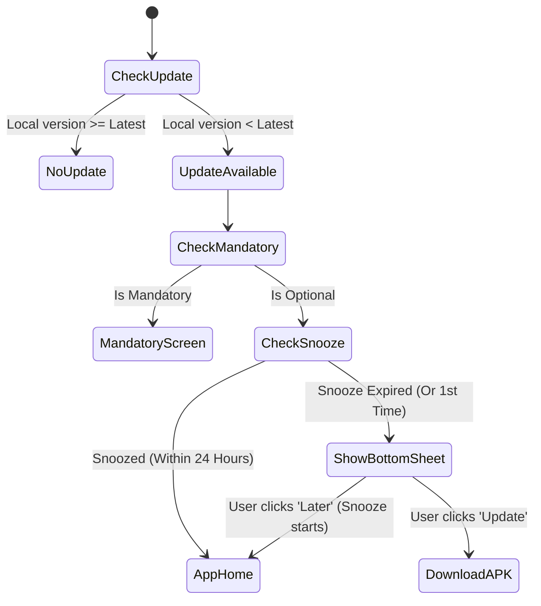

# UI/UX Design Recommendations: Mobile App Update System

This guide outlines modern, premium UI/UX design patterns for handling direct APK updates outside the Google Play Store, balancing user experience (UX) with the necessity of keeping users on supported software.

---

## 1. UI Patterns: Dialogs vs. Bottom Sheets vs. Full Screen

| Update Type | UI Pattern | UX Rationale |
| :--- | :--- | :--- |
| **Optional Update** | **Modal Bottom Sheet** | Bottom sheets are more reachable on modern large screens than center dialogs. They feel native and less disruptive. |
| **Mandatory Update** | **Full-Screen Blockout Page** | Using a standard dismissible dialog is dangerous. A full-screen page with zero navigation options guarantees the user cannot bypass the blocker. |

---

## 2. Optional Updates: Reminding Users Without Being Intrusive

Once an optional update is dismissed (user clicks "Later"), we want to keep the option to update easily accessible without nagging the user.

### Recommended UI Patterns (Choose One or Combine)

#### Pattern A: The Profile/Settings Badge (Standard Industry Practice)
* **How it works**: Put a small red/accent dot (badge) next to the "Settings" or "Profile" icon in the navigation bar. Inside the Settings page, display a prominent item: `"Update Available (v1.2.0)"` with a download icon.
* **Why it's good**: Extremely clean. It uses existing native UI space and doesn't disrupt any core workflows.

```
+------------------------------------+
|  Profile                  [Done]   |
+------------------------------------+
|  [!] Update Available! (v1.2.0) >  |  <-- Interactive, accent-colored tile
+------------------------------------+
|  Personal Details                  |
|  Language                          |
+------------------------------------+
```

#### Pattern B: The Floating Persistent Chip (High Visibility, Low Clutter)
* **How it works**: Display a tiny, floating pill-shaped button (e.g., "Update available") at the bottom of the screen (above the navigation bar or tab bar) that only appears on the Home/Explore tab.
* **Why it's good**: Reminds the user instantly upon opening the app, but collapses/disappears when they scroll or navigate away.

#### Pattern C: Inline Dashboard Card
* **How it works**: Put an update card at the top of the feed or dashboard.
* **Why it's good**: Integrates directly into content consumption. The user can swipe to dismiss it, or it will remain statically at the top of their dashboard.

---

## 3. Mandatory Updates: The Full-Screen Blocker

For critical or mandatory updates, do not use dialogs because users can sometimes bypass them (e.g., by hitting the hardware back button or trigger system navigation events). 

### UX Checklist for Blocker Page:
* **No Back Button**: Intercept the system back button (`PopScope` in Flutter) to disable back navigation.
* **Clear Value Proposition**: Explain *why* the update is mandatory (e.g., *"We have introduced security upgrades to protect your account. The current version is no longer supported."*).
* **Two Action Buttons**:
  1. **Update Now**: Primary bold accent button.
  2. **Exit App**: Minimal secondary outline/text button. (Users appreciate having an exit button instead of being forced to kill the app via system settings).

---

## 4. Frequency and Timing (The "Snooze" Logic)

To prevent the update prompts from becoming annoying, implement **Snooze Logic**:



### Recommendations:
1. **Initial Check**: Check for updates once per app launch, or once every 24 hours if the app stays running in the background.
2. **Snooze Period**: When the user clicks "Later" on an optional update, save the timestamp in local storage (`SharedPreferences`). **Suppress the bottom sheet prompt for 24 hours**.
3. **Persist the settings badge**: Even while the modal prompt is snoozed, the profile/settings badge remains visible. This gives active users a silent route to trigger the update when they have time.

---

## 5. Production Edge Cases to Consider

* **No Internet Connection**: If the update API check fails because of bad network connectivity, fail silently. Do not show any update screen or lock the user out unless they are completely offline and the app requires network.
* **In-Progress Download Feedback**: Directing the user to a browser link is simple, but if you download the APK directly inside the app, display a progress bar (e.g., "Downloading... 45%").
* **OS-Level Permissions**: On modern Android, installing APKs from unknown sources requires runtime permission. Make sure to catch any permission exceptions and show a friendly dialog explaining why they need to enable "Allow from this source" in system settings.
