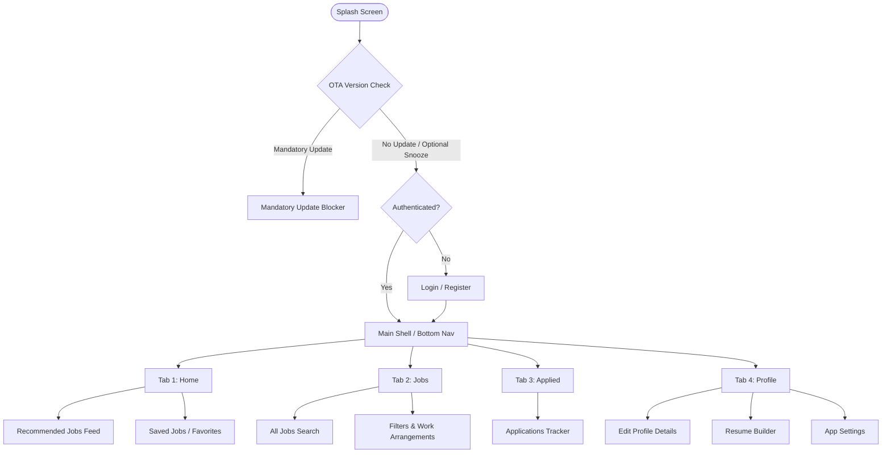
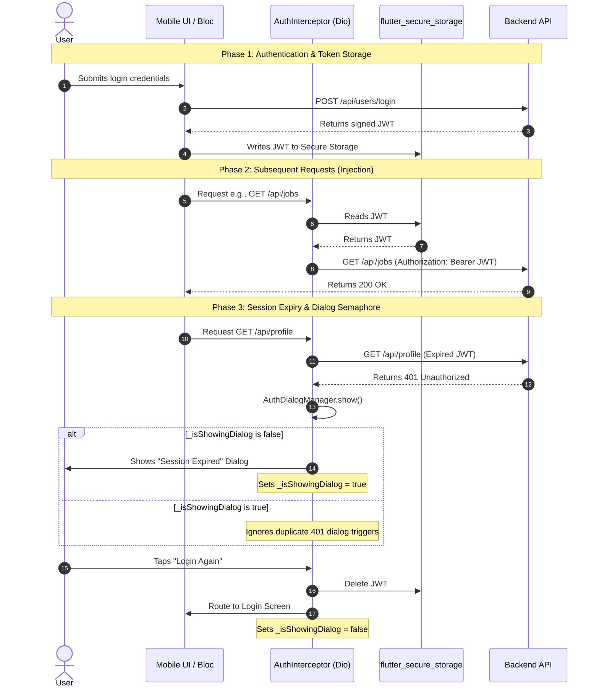
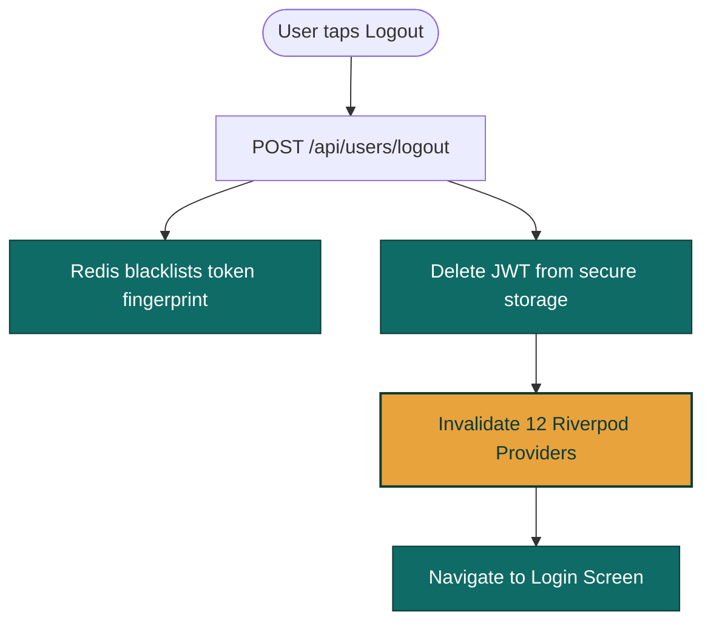
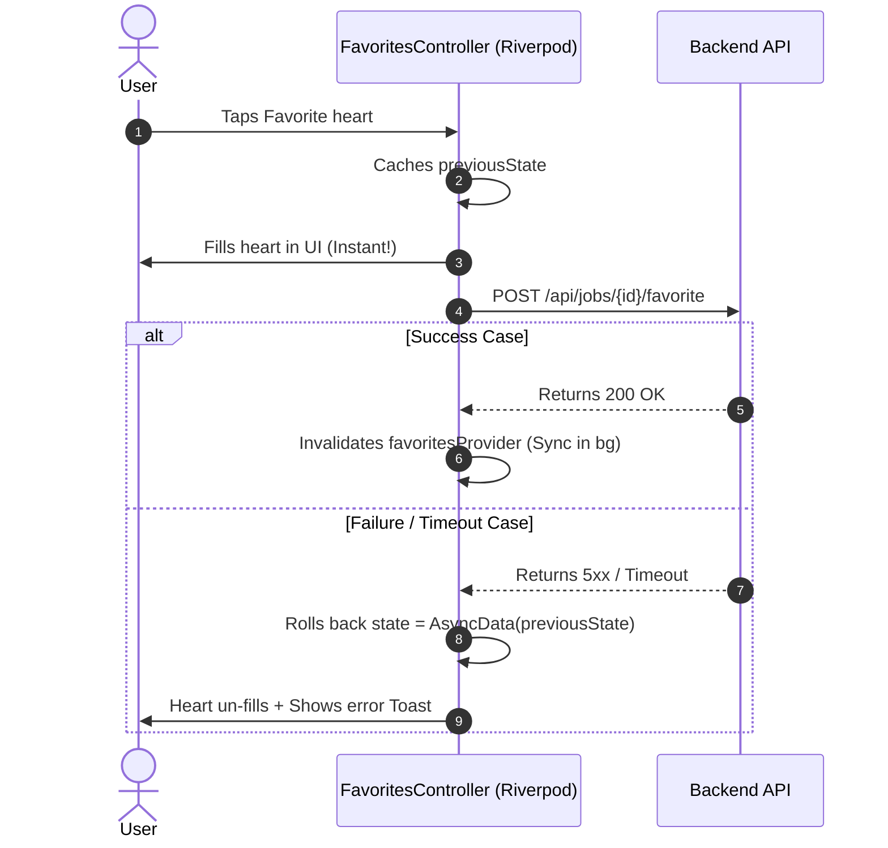
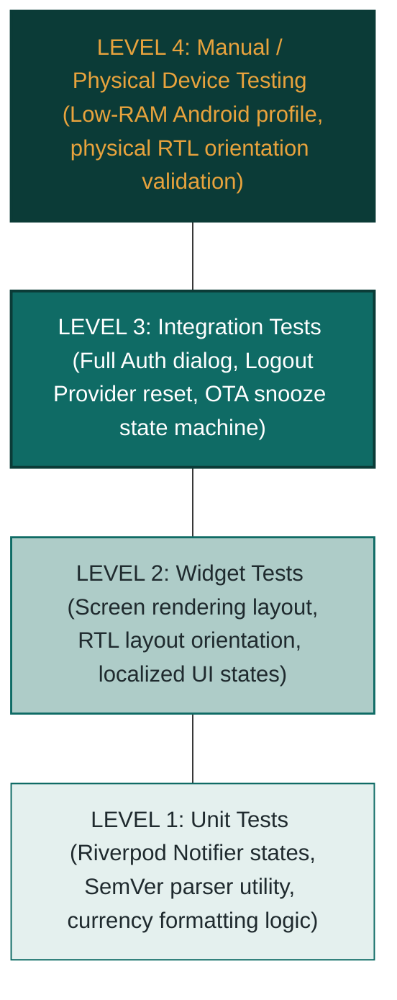

# Mobile Presentation — Slide Design Specification
# `mobile_build.js` — Continuation of the HireConnect deck

> **How to use this file**
> Each slide is a self-contained design spec.
> Review one slide at a time. Mark it ✅ APPROVED, ✏️ NEEDS CHANGES, or ❌ SKIP.
> After all slides are approved, `mobile_build.js` will be generated from this document.

---

## Slide Numbering

These slides continue the existing `build.js` counter.
`build.js` ends at slide **23** (footer counter `n = 23`).
Mobile slides begin at **n = 24** and use the section footer label `"Mobile App"`.

---

## Slide Review Status

| # | Title | Status |
|---|-------|--------|
| M01 | What the Mobile App Offers | ✅ APPROVED |
| M02 | Mobile App — Navigation Architecture | ✅ APPROVED |
| M03 | Secure Token Storage | ✅ APPROVED |
| M04 | Authentication Flow & Dio Interceptor | ✅ APPROVED |
| M05 | Logout & Multi-Account Cache Isolation | ✅ APPROVED |
| M06 | OTA Updates — The Play Store Problem | ✅ APPROVED |
| M07 | OTA Updates — Implementation & Snooze State Machine | ✅ APPROVED |
| M08 | Localisation & RTL Support | ✅ APPROVED |
| M09 | Parallel Aggregation — Profile Page | ✅ APPROVED |
| M10 | Optimistic UI Updates & Rollback | ✅ APPROVED |
| M11 | Multi-Currency Reactive State | ✅ APPROVED |
| M12 | In-App Feedback & Anonymous Submission | ✅ APPROVED |
| M13 | Performance Benchmarks & Hybrid Pagination | ✅ APPROVED |
| M14 | Testing Hierarchy & Validation | ✅ APPROVED |
| M15 | Completed & Roadmap (Mobile) | ✅ APPROVED |

---
---

## M01 — What the Mobile App Offers

**Status:** ✅ APPROVED

### Why is this slide here?
This is the opening context slide for the mobile section. It answers the most
basic examiner question before they even ask it: *"What does the mobile app
actually do?"* It frames every engineering decision that follows by showing
the product scope clearly.

### Key Takeaway
The mobile app serves seasonal job seekers end-to-end — from building a resume
to applying, tracking, and getting notified — all in one place.

### Story Beat
Scope → User value → Handoff to engineering

### Speaking Time
~1 min

---

### Layout
Dark background (`TEAL_DARK`). Three-column feature group layout with a
central "user journey" banner running across the top.

- **Top banner:** Three-phase journey strip — Discover → Apply → Track
- **Three columns below:** grouped features per phase
- **Right side:** Phone mockup placeholder

### Visual Spec

> **[FIGURE HINT — M01-A]**
> **Filename:** `fig_app_mockup_feed.png`
> **Type:** App Screenshot / Phone Mockup
> **Content:**
>   A phone frame showing the personalized job feed screen.
>   Alternatively, a composite of 2–3 screens (feed, apply, profile)
>   arranged in an overlapping stack.
> **Placement:** Right side — x=9.8, y=1.6, w=3.1, h=5.5
> **Resolution:** 620×1100 px minimum

### Content

**Top journey strip (3 amber-labelled phases):**
```
[ DISCOVER ]          [ APPLY ]            [ TRACK ]
Find the right job    Submit instantly      Stay informed
```

**Column 1 — Profile & Resume:**
```
Onboarding
  Profile photo & personal details

Resume Builder
  Education, experience, certificates,
  skills, languages

```

**Column 2 — Job Discovery:**
```
Personalized Feed
  Ranked by matching engine
  (skills, interests, location)

Search & Filter
  Job type, salary model,
  work arrangement, location

Favorites
  Save jobs to review later
```

**Column 3 — Applications & Notifications:**
```
One-Tap Apply
  With optional cover letter

Application Tracker
  Real-time status updates
  (Pending → Accepted / Rejected)

Notifications
  Push (Firebase FCM)
  + email opt-in
```

### Kicker
`Mobile App`

### Title
`What the Mobile App Offers`

### Speaker Notes
```
"The mobile client is built exclusively for job seekers. The platform
covers the full application lifecycle — from building a professional
resume to discovering ranked opportunities, submitting with a single tap,
and tracking application status in real time. Every screen serves a
specific purpose in that journey. In the slides that follow, I will
explain the engineering decisions behind how each of these capabilities
was built reliably and securely."

Transition: "Let me start with how the app is structured — the navigation
architecture."
```

### Expected Examiner Questions
- Who is the mobile app for — both job seekers and employers?
- Does the app support offline usage?
- How does the matching engine rank the job feed?

---
---

## M02 — Mobile App — Navigation Architecture

**Status:** ✅ APPROVED

### Why is this slide here?
Shows the examiner that the app's screens are organized deliberately — not
added one-by-one. It anchors every subsequent engineering slide by giving
the audience a mental map of where features live.

### Key Takeaway
The app has a deliberate, layered navigation structure.
Every screen has a purpose and a place.

### Story Beat
Context → Scope

### Speaking Time
~1.5 min

---

### Layout
Two-column layout on a **white** background.

- **Left column (55%):** Navigation flow diagram
- **Right column (45%):** Vertical feature-group list (4 Bottom-nav tabs)

### Visual Spec

> **[FIGURE HINT — M02-A]**
> **Filename:** `fig_navigation_flow.png`
> **Type:** Navigation / Screen Flow Diagram
> **Content:** See diagram below.
> **Style:** Teal nodes, amber decision diamonds, white text labels, dark background.
> **Placement:** Left column — x=0.6, y=1.75, w=7.0, h=4.9
> **Resolution:** 1400×980 px minimum



### Content — Right Column Feature Groups

```
TAB 1 — HOME
  Personalized job recommendations
  Saved jobs / Favorites list

TAB 2 — JOBS
  All jobs feed with search
  Filter by type, location, salary model

TAB 3 — APPLIED
  Real-time applications tracker
  Status details (Pending, Accepted, Rejected)

TAB 4 — PROFILE
  Resume builder & certifications
  Edit profile & personal info
  App settings (language, currency)
```

### Kicker
`Mobile App`

### Title
`Application Architecture & Navigation Flow`

### Speaker Notes
```
"Before we go into the engineering decisions, let me orient you to what
the app contains. The mobile client has four main sections accessible from a
bottom navigation bar. Every app launch begins with an OTA version check gate.
If there's no mandatory update, we check authentication and either guide
the user to login or route them directly to the main app shell."

Transition: "Let me start with one of the first decisions we had to make —
where to store the JWT token securely."
```

### Expected Examiner Questions
- How did you decide on bottom navigation vs a side drawer?
- Why did you consolidate into four tabs instead of five?
- How does the OTA check affect cold-start time?

---
---

## M03 — Secure Token Storage

**Status:** ✅ APPROVED

### Why is this slide here?
Security is always a top examiner target. The choice of `flutter_secure_storage`
over `SharedPreferences` is a real, defensible engineering decision with clear
trade-offs — exactly the kind of content the presentation rules say to emphasize.

### Key Takeaway
`SharedPreferences` is not safe for secrets. The OS keychain is the correct
layer for JWT tokens.

### Story Beat
Problem → Alternatives Considered → Decision → Trade-offs

### Speaking Time
~2 min

---

### Layout
Dark background (`TEAL_DARK`). Two comparison cards + article screenshot placeholder.

- **Left card:** What SharedPreferences is, and why it fails for secrets
- **Right card:** What flutter_secure_storage provides + trade-offs
- **Bottom-left:** Article screenshot placeholder

### Visual Spec

> **[FIGURE HINT — M02-A]**
> **Filename:** `fig_shared_prefs_article.png`
> **Type:** App Screenshot
> **Content:**
>   Screenshot of the Medium article titled:
>   "Stop Storing Tokens in SharedPreferences — Here's the Secure Way in Flutter"
>   Crop to show only the title and the first paragraph.
> **Placement:** Bottom-left area — x=0.6, y=5.5, w=5.85, h=1.3
> **Resolution:** 900×400 px minimum

### Content

**Left card — ❌ SharedPreferences**
```
• Backed by Android XML file in /data/data/<package>/
• Readable by any process with root access
• Not encrypted at the OS level
• Subject to Android cloud backup by default
  → token can survive an app uninstall on some devices
• No iOS Keychain equivalent — not portable
```

**Right card — ✅ flutter_secure_storage**
```
• Android: uses Android Keystore + EncryptedSharedPreferences
• iOS: uses the native Keychain Services API
• Keys are hardware-bound on supported devices
• Cleared on app uninstall (unlike cloud-backed prefs)
• Trade-off: slightly slower read (~1–3 ms vs ~0.1 ms)
• Trade-off: keystore wiped on device factory reset
  → acceptable: user simply re-authenticates
```

**Bottom banner (white text on TEAL strip):**
```
"The performance penalty is negligible. The security boundary is not optional."
```

### Kicker
`Security`

### Title
`Why We Don't Store JWT in SharedPreferences`

### Speaker Notes
```
"When we implemented authentication, the first question was: where does the
JWT token live after login? SharedPreferences is the obvious default for
Flutter developers — it is simple and fast. But it stores data as plain XML
on disk. On a rooted Android device, any process can read it. The Medium
article on screen was part of our research — it was a clear signal from the
Flutter community that this is a known pitfall. flutter_secure_storage routes
token writes through the Android Keystore system — the same API banks and
payment apps use. The read latency is a few milliseconds longer, which is
completely undetectable in a login flow. This was a non-negotiable decision."

Transition: "Now that we know where the token lives, let me show you what
happens every time it is used — and what happens when it expires."
```

### Expected Examiner Questions
- What is the realistic threat model — who would root a seasonal worker's phone?
- What happens when the user clears app data?
- Is flutter_secure_storage audited or production-proven?
- Could you have used EncryptedSharedPreferences directly?

---
---

## M04 — Authentication Flow & Dio Interceptor

**Status:** ✅ APPROVED

### Why is this slide here?
The Dio interceptor is a sophisticated architectural pattern — a global HTTP
middleware that handles token injection and session expiry. It demonstrates
thinking beyond basic API calls. The semaphore pattern for dialog management
is a concrete, memorable engineering decision.

### Key Takeaway
A single `AuthInterceptor` manages token injection and expiry detection globally.
An in-memory semaphore prevents duplicate session-expired dialogs from stacking.

### Story Beat
Implementation → Problem Discovered → Solution (semaphore pattern)

### Speaking Time
~2 min

---

### Layout
Dark background (`TEAL_DARK`). Left: sequence diagram placeholder. Right: two explanation cards.

### Visual Spec

> **[FIGURE HINT — M03-A]**
> **Filename:** `fig_auth_sequence.png`
> **Type:** Sequence Diagram
> **Content:** See diagram below.
> **Style:** Teal swimlanes, amber decision nodes, white text.
> **Placement:** Left side — x=0.6, y=1.75, w=7.2, h=4.9
> **Resolution:** 1440×980 px minimum



### Content — Right Cards

**Card 1 — AuthInterceptor:**
```
• Global Dio HTTP wrapper
• Reads JWT from flutter_secure_storage before every request
• Appends: Authorization: Bearer <token>
• Intercepts 401 / 403 responses after they return
• Delegates expiry handling to AuthDialogManager
• No token logic lives in the UI layer
```

**Card 2 — AuthDialogManager — Semaphore Pattern:**
```
Problem:
  Profile page fires 4 parallel API calls.
  If session expires, all 4 return 401 simultaneously.
  → Without a guard: 4 "Session Expired" dialogs stack.

Solution — In-memory boolean semaphore:
  bool _isShowingDialog = false;

  First 401 → raise flag → show dialog
  Subsequent 401s → flag is true → silently swallowed
  Flag is cleared only when user dismisses the dialog
```

### Kicker
`Security`

### Title
`Authentication Flow & Dio Interceptor`

### Speaker Notes
```
"Every authenticated API call goes through the AuthInterceptor.
It reads the token from secure storage and attaches it as a Bearer header —
developers never touch token logic in the UI layer. The interesting engineering
problem appeared when we discovered that the profile page makes four parallel
calls. If the session expires, all four return 401 at the same time. Without
a guard, four dialogs stack on top of each other. We solved this with a boolean
semaphore. The first 401 raises the flag and shows the dialog. The rest are
silently discarded. The pattern is borrowed from operating systems — a binary
semaphore for mutual exclusion on UI critical sections."

Transition: "After the user logs out, we face a different kind of problem."
```

### Expected Examiner Questions
- Why Dio instead of the standard http package?
- What is a semaphore in OS terms — why use that analogy here?
- What if the token expires while the user is mid-form — do they lose their data?
- Could you implement token refresh instead of forcing re-login?

---
---

## M05 — Logout & Multi-Account Cache Isolation

**Status:** ✅ APPROVED

### Why is this slide here?
Resetting 13 Riverpod providers on logout is a specific, measurable engineering
decision driven by a real risk — data leakage on shared devices. Seasonal workers
genuinely share phones, making this a non-hypothetical concern.

### Key Takeaway
Logout is not just clearing a token. All in-memory state must be invalidated —
or the next user on the same device sees stale data from the previous session.

### Story Beat
Problem → Real-world risk → Implementation → Verification

### Speaking Time
~1.5 min

---

### Layout
White background. Two-column layout.
- **Left (55%):** Logout sequence flow diagram placeholder
- **Right (45%):** Provider inventory card + risk statement

### Visual Spec

> **[FIGURE HINT — M05-A]**
> **Filename:** `fig_logout_flow.png`
> **Type:** Vertical Flowchart
> **Content:** See diagram below.
> **Style:** Teal boxes, amber highlight node, dark arrow connectors.
> **Placement:** Left column — x=0.6, y=1.75, w=7.0, h=4.9
> **Resolution:** 700×980 px minimum



### Content — Right Card

**Why 12 providers? — What gets cached:**
```
Profile data         → user name, photo, role
Resume data          → skills, education, experience
Applied jobs list    → application status per job
Favorite jobs list   → bookmarked job IDs
Interest tags        → field-of-interest chips
Job feed pages       → paginated job results (each page)
Search results       → last query + active filters
Notifications        → unread count + notification list
Currency setting     → selected currency code
Language setting     → AR / EN preference
Personal info        → contact details
Auth state           → current authenticated principal
```

**Risk statement (bottom banner):**
```
"On a shared device, skipping any one of these leaks the previous
user's data to the next. Seasonal workers share devices — this is
a real scenario, not a hypothetical."
```

### Kicker
`Security`

### Title
`Logout & Multi-Account Cache Isolation`

### Speaker Notes
```
"Logout in a stateless JWT system has two parts. At the backend, the
server blacklists the token fingerprint in Redis so it cannot be reused
even before it expires. On the client, we had a subtler problem. Riverpod
caches API responses in provider state for the lifetime of the provider.
Without explicitly invalidating those providers, a new user on the same
device briefly sees the previous user's profile photo, applied jobs, and
favorites. We enumerated every provider that holds user-specific data —
thirteen in total — and invalidate all of them on logout. This is tested
as an explicit multi-account isolation scenario."

Transition: "Let me move to a completely different engineering challenge
— how we handle app updates without the Play Store."
```

### Expected Examiner Questions
- How did you identify all 13 providers — manual audit or automated?
- What happens if a new provider is added and the developer forgets to add it to the logout list?
- Is the cache isolation test automated or manual?
- What is Riverpod's ref.invalidate() — how does it differ from ref.refresh()?

---
---

## M06 — OTA Updates — The Play Store Problem

**Status:** ✅ APPROVED

### Why is this slide here?
The OTA update system is the most original engineering decision in the mobile app.
It requires a dedicated problem-setup slide. Without context, the solution looks
over-engineered. With context, it looks like a smart, principled workaround.

### Key Takeaway
Distributing updates without the Play Store is a real engineering constraint —
and it decomposes into two solvable sub-problems.

### Story Beat
Problem → Constraints → Problem decomposition → Decision framing

### Speaking Time
~2 min

---

### Layout
Dark background (`TEAL_DARK`). Top row: "Standard Flow" blocks. Middle: constraint card. Bottom: decomposed solution.

### Content

**Top row — The Standard Play Store Flow (4 sequential boxes):**
```
[1] Developer signs APK
[2] Uploads to Play Store ($25 one-time fee)
[3] Store notifies all installed users
[4] User downloads update in one tap
```

**Middle — The Constraint (wide AMBER-accented card):**
```
As a graduation project, the Play Store registration fee is an undefined
cost we chose not to commit to before validating the product.

We still required:
  ✓ Automated APK builds on every code push
  ✓ Users to know when a new version is available
  ✓ Users to be able to download it with minimal friction
```

**Bottom — Problem Decomposition:**
```
Problem 1: How do we build the APK automatically?
  → GitHub Actions CI/CD builds and publishes a new release on every push.

Problem 2: How do users know there is an update?
  → The naive answer: backend endpoint GET /version
     But that adds: mobile → backend → GitHub → backend → mobile

  → Better: the mobile client queries the GitHub Releases API directly.
     No intermediary. One fewer network hop. No extra backend code.
```

### Kicker
`OTA Updates`

### Title
`The Play Store Problem — Why We Built Our Own Update System`

### Speaker Notes
```
"Every mobile app needs a way to push updates. The standard path is the
Play Store. The $25 fee is completely reasonable for a production app,
but for a graduation project that has not yet validated its market, it
felt premature. So we broke the problem into two parts. The build automation
side was straightforward — GitHub Actions already builds our APK on every
push to the repository. The notification side was more interesting. We
could have added a backend version endpoint, but that just inserts an
unnecessary relay. The mobile client can call the GitHub Releases API
directly to get the latest release title and tag. No intermediary,
no extra server code."

Transition: "Let me show you exactly how the classification and snooze
logic works."
```

### Expected Examiner Questions
- Does the GitHub Releases API have rate limits that could affect this?
- Why not use Firebase Remote Config to broadcast version numbers?
- Could you have used CodePush or Shorebird instead?
- What happens when the project moves to production — does this system get replaced?

---
---

## M07 — OTA Updates — Implementation & Snooze State Machine

**Status:** ✅ APPROVED

### Why is this slide here?
This is the payoff slide for M05. It shows a complete, production-quality
implementation with thoughtful UX decisions — mandatory vs optional classification,
24-hour snooze, and a sett### Layout
White background. Two-column layout.
- **Left (55%):** Full state machine flow diagram
- **Right (45%):** Screenshots stacked vertically

### Visual Spec

> **[FIGURE HINT — M07-A]**
> **Filename:** `fig_ota_state_machine.png`
> **Type:** State Machine / Flowchart
> **Content:** See flowchart below.
> **Placement:** Left column — x=0.6, y=1.75, w=7.2, h=4.9
> **Resolution:** 1440×980 px minimum

```mermaid
graph TD
    Start([App Launches]) --> GetRelease[Query GitHub Releases API]
    GetRelease --> ParseTag[Parse Latest SemVer Tag & Title]
    ParseTag --> CompareVersions{Latest Tag > Local Version?}
    
    CompareVersions -->|No| NormalRun[Proceed to Auth/Main Screen]
    
    CompareVersions -->|Yes| CheckMandatory{Is Major increment OR title has [MANDATORY]?}
    
    CheckMandatory -->|Yes| Blocker[Show Mandatory Update Blocker]
    Blocker --> PopScope[PopScope Blocks Navigation]
    PopScope --> Download[User must download APK to continue]
    
    CheckMandatory -->|No| CheckSnooze{Read 24-hr snooze from storage: Active?}
    
    CheckSnooze -->|Yes| NormalSettingsBadge[Proceed to Feed + Show Settings Red Badge]
    CheckSnooze -->|No| ShowOptional[Show Optional Modal Bottom Sheet]
    
    ShowOptional -->|User taps Update| ReleasePage[Open Release Page in Browser]
    ShowOptional -->|User taps Later| Snooze[Write Snooze Timestamp to Storage]
    Snooze --> NormalSettingsBadge
```

> **[FIGURE HINT — M07-B]**
> **Filename:** `fig_optional_update_screen.png`
> **Type:** App Screenshot
> **Content:** Optional update Modal Bottom Sheet
> **Placement:** Right column top — x=8.2, y=1.75, w=4.5, h=2.35
>
> **[FIGURE HINT — M07-C]**
> **Filename:** `fig_mandatory_update_screen.png`
> **Type:** App Screenshot
> **Content:** Mandatory update full-screen blocker
> **Placement:** Right column bottom — x=8.2, y=4.3, w=4.5, h=2.35

### Kicker
`OTA Updates`

### Title
`OTA Implementation — Mandatory vs Optional & Snooze Flow`

### Speaker Notes
```
"The classification logic is the most important engineering decision here.
Semantic versioning alone is insufficient because our CI pipeline increments
the patch number on every single commit — a critical security fix and a
spelling correction look identical from the version number alone. We added
a manual escape hatch: if the release title contains the string [MANDATORY],
the app forces the update regardless of version numbers. The snooze mechanism
is deliberate. Interrupting users every launch with an optional update dialog
is disruptive UX. Instead, we cache a timestamp in secure storage and suppress
the modal for 24 hours. The settings tab badge keeps the update discoverable
without being aggressive."
```

### Expected Examiner Questions
- What happens if the GitHub API is unreachable due to no internet?
- Why store the snooze timestamp in flutter_secure_storage rather than SharedPreferences?
- Why PopScope specifically — what does it actually intercept?
- What is your rollback strategy if a bad release is accidentally pushed?
- Could you push delta updates instead of full APK downloads?

---
---

## M08 — Localisation & RTL Support

**Status:** ✅ APPROVED

### Why is this slide here?
Arabic support is non-negotiable for the target market. This slide shows it
was treated as a systematic engineering concern, not an afterthought.

### Key Takeaway
RTL support is not a toggle — it requires strings, layout direction,
icon mirroring, and typography to all be handled correctly.

### Story Beat
Constraint → Decision → What it took

### Speaking Time
~1 min

---

### Layout
White background. Top screenshots comparison + bottom card explaining why it is required.

### Visual Spec

> **[FIGURE HINT — M08-A]**
> **Filename:** `fig_rtl_comparison.png`
> **Type:** Side-by-Side App Screenshot
> **Content:**
>   Left half: Same screen in English (LTR layout).
>   Right half: Same screen in Arabic (RTL layout — text right-aligned, icons mirrored).
>   Preferred screen: Job Feed or Profile screen.
>   Label each half: "English (LTR)" / "العربية (RTL)"
> **Placement:** Top center — x=0.6, y=1.75, w=12.1, h=3.5
> **Resolution:** 1400×800 px minimum

### Content

```
Why it was required:
  Our primary target market is Egypt — Arabic is the dominant language for seasonal workers.
  Without full RTL layout, text aligns incorrectly, list items render backwards, and 
  navigation gestures mirror incorrectly, causing severe usability issues.
```

### Kicker
`Localisation`

### Title
`Arabic / English Localisation & RTL Support`

### Speaker Notes
```
"Our target market is Egypt. Arabic is non-negotiable. RTL support in
Flutter is not a single switch — every string lives in a translation
file, every padding uses start/end semantics, and every directional icon
is tested in both layouts. The language toggle switches the entire app
instantly without restarting."
```

### Expected Examiner Questions
- How do you handle mixed Arabic/English text in a single field?
- What if a translation key is missing from ar.arb?
- Does RTL affect the navigation animation direction?

---
---

## M09 — Parallel Aggregation — Profile Page

**Status:** ✅ APPROVED

### Why is this slide here?
Shows awareness of mobile network performance as a design concern.
Sequential API calls are a silent UX problem — the fix is concrete and measurable.

### Key Takeaway
By firing four API calls concurrently with Future.wait, Time-to-Interactive (TTI)
is bounded by the slowest single call — not the sum of all calls.

### Story Beat
Problem → Measurement → Solution → Trade-offs

### Speaking Time
~1.5 min

---

### Layout
White background. Two-column layout.
- **Left (50%):** Sequential vs parallel timeline comparison placeholder
- **Right (50%):** Explanation card + code snippet

### Visual Spec

> **[FIGURE HINT — M09-A]**
> **Filename:** `fig_parallel_aggregation.png`
> **Type:** Horizontal Timeline Comparison Diagram
> **Content:** See diagram below.
> **Placement:** Left column — x=0.6, y=1.75, w=6.0, h=4.0
> **Resolution:** 1200×800 px minimum

```mermaid
gantt
    title Sequential vs Parallel Timeline (TTI Comparison)
    dateFormat  X
    axisFormat %s ms
    
    section Sequential (TTI ≈ 800ms)
    GET /users/me         :active, s1, 0, 200
    GET /applications     :active, s2, after s1, 200
    GET /favorites        :active, s3, after s2, 200
    GET /interests        :active, s4, after s3, 200
    
    section Parallel (TTI ≈ 200ms)
    GET /users/me         :done, p1, 0, 200
    GET /applications     :done, p2, 0, 180
    GET /favorites        :done, p3, 0, 150
    GET /interests        :done, p4, 0, 190
```



### Content — Right Card

**The Problem:**
```
Profile screen requires 4 separate API calls:
  GET /api/users/{uid}           user profile
  GET /api/applications/user     applied jobs
  GET /api/jobs/favorites        saved jobs
  GET /api/users/FOI/{uid}      interest tags

Sequential execution:
  TTI = t1 + t2 + t3 + t4
  On a 200ms-per-call connection: ~800ms before anything renders
```

**The Solution — Future.wait:**
```dart
final results = await Future.wait([
  _userRepo.getProfile(uid),
  _applicationRepo.getUserApplications(),
  _jobRepo.getFavorites(),
  _userRepo.getInterests(),
]);
```
```
TTI = max(t1, t2, t3, t4) ≈ 200ms
All four calls race in parallel.
Screen assembles when all four resolve.
```

**Trade-off:**
```
• Future.wait throws immediately if any call fails.
• Mitigation: error boundary wraps the profile notifier.
  Individual sections show skeleton loaders on partial failure.
```

### Kicker
`Performance`

### Title
`Parallel Aggregation — Eliminating Sequential Round-Trips`

### Speaker Notes
```
"The profile page is the most data-heavy screen. On first load it needs
the user profile, application history, saved jobs, and interest tags.
The naive implementation fetches these sequentially — each request waits
for the previous to finish. On a mobile connection with 200ms round-trip
latency, that is 800ms before anything renders. We replaced this with a
single Future.wait call that fires all four requests simultaneously. TTI
drops to the slowest individual call — roughly 200ms. The only architectural
risk is failure atomicity: Future.wait rejects immediately when any call fails.
We handle this with individual section-level error boundaries."
```

### Expected Examiner Questions
- What is TTI and why does it matter for mobile UX?
- What if one of the four calls is significantly slower — do all four still complete first?
- Why not serve a cached stale profile and refresh in the background (stale-while-revalidate)?

---
---

## M10 — Optimistic UI Updates & Rollback

**Status:** ✅ APPROVED

### Why is this slide here?
Optimistic UI is a well-known pattern but non-trivial to implement correctly
with proper rollback. It demonstrates that perceived performance was treated
as a first-class engineering concern.

### Key Takeaway
The UI updates instantly on user action. If the server rejects the change,
the state rolls back automatically — no stale UI, no silent failure.

### Story Beat
Problem → Decision → Implementation → Trade-offs

### Speaking Time
~1.5 min

---

### Layout
White background. Two-column layout.
- **Left (50%):** Rollback sequence diagram placeholder
- **Right (50%):** Explanation card with state rollback pattern

### Visual Spec

> **[FIGURE HINT — M10-A]**
> **Filename:** `fig_optimistic_update.png`
> **Type:** Sequence Diagram
> **Content:** See sequence below.
> **Placement:** Left column — x=0.6, y=1.75, w=6.5, h=4.9
> **Resolution:** 1300×980 px minimum



### Content — Right Card

**The Problem:**
```
Without optimistic UI:
  User taps heart → waits for network response → heart fills after 200-400ms
  On slow connections: perceivable delay — feels broken or unresponsive
```

**The Pattern — FavoritesController:**
```
Step 1: Cache current state
  final previousState = state.value;

Step 2: Update UI immediately (before the HTTP request)
  state = AsyncData(updatedFavoritesList);

Step 3: Fire async HTTP request in the background

Step 4a: On success
  ref.invalidate(favoriteJobsProvider);  // pull updated list

Step 4b: On failure
  state = AsyncData(previousState);      // restore
  show user-facing error toast
```

**Trade-offs:**
```
• Brief inconsistency if the server rejects the action
  → Mitigated by immediate rollback + visible toast
• Slightly more complex controller logic than a simple await
  → The perceived performance improvement justifies the complexity
• State rollback must be explicitly tested
```

### Kicker
`Performance`

### Title
`Optimistic UI Updates & Automatic Rollback`

### Speaker Notes
```
"Tapping a favorite heart icon should feel instant — not like waiting
for a network confirmation. We implement the optimistic update pattern.
The controller immediately reflects the new state in the UI while the
HTTP request fires asynchronously in the background. The previous state
is cached. If the request fails — network timeout, server error — the
controller catches the exception, restores the cached state, and shows
the user an error message. No silent failure. No stale UI. The heart
flips back and the user knows something went wrong."
```

### Expected Examiner Questions
- What if the user taps the heart again before the first request resolves?
- How do you prevent double-submission on the apply button?
- Is AsyncNotifier the right Riverpod tool for this, or would StreamNotifier work better?

---
---

## M11 — Multi-Currency Reactive State

**Status:** ✅ APPROVED

### Why is this slide here?
Shows reactive state design using Riverpod's watch/select pattern. A currency
change in settings propagates automatically to the entire job feed without any
manual refresh. This is declarative, clean, and extensible.

### Key Takeaway
Currency selection is a reactive signal. Dependent providers watch it and auto-reload
— no event bus, no explicit callbacks, no manual refresh required.

### Story Beat
Feature requirement → Reactive design decision → Implementation

### Speaking Time
~1.5 min

---

### Layout
White background. Two-column layout.
- **Left (50%):** Reactive dependency graph placeholder
- **Right (50%):** Explanation + code snippet card

### Visual Spec

> **[FIGURE HINT — M11-A]**
> **Filename:** `fig_currency_reactive.png`
> **Type:** Dependency / Signal Flow Diagram
> **Content:** See diagram below.
> **Placement:** Left column — x=0.6, y=1.75, w=6.0, h=4.5
> **Resolution:** 1200×900 px minimum

```mermaid
graph TD
    User([User selects Currency in Settings]) -->|PATCH /api/users/{uid}| API[Backend API]
    API -->|Success| Provider[personalInformationProvider Updated]
    
    subgraph Riverpod Watchers
        Provider -->|ref.watch select| FeedNotifier[PaginatedJobsNotifier]
        Provider -->|ref.watch select| RecsNotifier[RecommendedJobsNotifier]
        Provider -->|ref.watch select| FavsNotifier[FavoriteJobsNotifier]
    end
    
    FeedNotifier -->|Invalidates & Re-fetches| FeedUI[Job Feed Screen Re-renders]
    RecsNotifier -->|Invalidates & Re-fetches| RecsUI[Recommended Jobs List Re-renders]
    FavsNotifier -->|Invalidates & Re-fetches| FavsUI[Favorites List Re-renders]
    
    style Provider fill:#E8A33D,stroke:#0B3B37,stroke-width:2px,color:#0B3B37
```

### Content — Right Card

**Supported currencies:**
```
EGP — Egyptian Pound (default)
USD — US Dollar
SAR — Saudi Riyal
+ extensible to any ISO 4217 currency code
```

**How it works:**
```
1. User selects currency in Settings
2. PATCH /api/users/{uid} — syncs preference to backend
3. personalInformationProvider state updated locally
4. Job feed and Favorites providers declare a watch dependency:
```
```dart
ref.watch(
  personalInformationProvider.select(
    (u) => u.value?.currency,
  ),
);
```
```
5. Currency change → provider auto-invalidates → feed & favorites reload
6. Job cards format salary using Dart's intl package:
   "USD" → $1,200   |   "EGP" → EGP 15,000
```

**Why reactive instead of manual:**
```
• No event bus, no explicit callbacks, no refresh button
• Provider graph handles propagation automatically to all list streams
• Adding a new currency-dependent screen (e.g. Saved lists, Feeds):
  add one ref.watch(...select(currency)) line — nothing else
```

### Kicker
`State Management`

### Title
`Multi-Currency — Reactive State Propagation`

### Speaker Notes
```
"When a user changes their currency in settings, every salary value on
every job card in the feed should update immediately — without pulling
to refresh. We achieve this through Riverpod's select watcher. The job
feed providers declare a dependency on just the currency field of the
personal information provider. When that single field changes, Riverpod
automatically invalidates and re-fetches only the providers that declared
that dependency. No imperative code. No event bus. Formatting uses Dart's
intl package — a single call formats the value correctly for any ISO
currency code."
```

### Expected Examiner Questions
- Does the watch cause unnecessary reloads on every user profile update — not just currency changes?
- How is the currency preference persisted across app restarts?
- What if the user is offline when they change the currency?

---
---

## M12 — In-App Feedback & Anonymous Submission

**Status:** ✅ APPROVED

### Why is this slide here?
Shows that quality was treated as a feedback loop — not just internal testing,
but giving users a direct channel to report issues from within the app.

### Key Takeaway
Users can report bugs with or without attaching their identity.
The anonymous toggle is a deliberate, user-facing privacy decision.

### Story Beat
Motivation → Feature

### Speaking Time
~45 sec

---

### Layout
White background. Screenshot on the left + right card explaining why it exists.

### Visual Spec

> **[FIGURE HINT — M12-A]**
> **Filename:** `fig_feedback_form.png`
> **Type:** App Screenshot
> **Content:** The in-app feedback form screen showing:
>   — A text area for the report body
>   — The anonymous toggle switch (visible and labeled)
>   — The submit button
> **Placement:** Left column — x=0.6, y=1.75, w=5.2, h=4.9
> **Resolution:** 900×980 px minimum

### Content

```
Why it exists:
  Every shipped app has bugs that survive testing. Users need a low-friction channel
  to report issues directly from the device.

Anonymous Toggle:
  OFF → payload includes user's authenticated email
  ON  → email is excluded from the JSON payload entirely

Benefit:
  Enables workers to report employer misconduct, payment issues, or safety hazards
  safely without disclosing their identity, preventing retaliation.
```

### Kicker
`UX & Quality`

### Title
`In-App Feedback & Anonymous Submission`

### Speaker Notes
```
"We built a feedback form directly into the app. Users can flag bugs
without leaving the platform. The only engineering decision worth
highlighting here is the anonymity toggle — when active, the email
field is excluded from the request payload entirely. Seasonal workers
reporting issues with a specific employer's listing should feel safe
doing so."
```

### Expected Examiner Questions
- Where do the reports go?
- How do you prevent spam submissions?

---
---

## M13 — Performance Benchmarks & Hybrid Pagination

**Status:** ✅ APPROVED

### Why is this slide here?
The benchmark data is evidence. Without the narrative connecting it to the
pagination decision, it is just a table. This slide fuses the data with the
engineering justification, and pre-empts the most common examiner question
about why 100,000 items were tested.

### Key Takeaway
The state engine scales efficiently to 100,000 items (14.5ms < 16.6ms frame budget).
The rendering layer does not. The 200-item pagination limit is set by RAM, not compute.

### Story Beat
Measurement → Analysis → Engineering decision justified by data

### Speaking Time
~2 min

---

### Layout
White background.
- **Top half:** Two performance tables side by side
- **Bottom half:** Wide engineering justification card

### Content

**Table 1 — CPU Execution Latency (Riverpod State Engine)**

| Data Scale | CPU Execution Latency | Status |
|---|---|---|
| 100 Jobs | ~0.15 ms | ✅ Excellent |
| 1,000 Jobs | ~1.25 ms | ✅ Excellent |
| 10,000 Jobs | ~8.10 ms | ✅ Good |
| 100,000 Jobs | ~14.50 ms | ✅ Safe (< 16.6 ms frame budget) |

**Table 2 — Memory (Heap) Projections**

| Jobs in Heap | Est. Memory Usage | Status |
|---|---|---|
| 100 Jobs | ~150 KB | ✅ Negligible |
| 1,000 Jobs | ~1.5 MB | ✅ Safe |
| 30,000+ Jobs | ~45.0 MB+ | ❌ OOM Risk on low-end devices |

**Bottom card — Engineering Justification:**
```
The Riverpod state engine is computationally efficient at any realistic scale.
The bottleneck is Flutter's widget inflation — rendering a ListView with 1,000+
job cards inflates the widget tree, consuming significant RAM and causing frame
jank on low-end Android hardware (the dominant device class in the target market).

Hybrid Pagination Strategy:
  • Auto-scroll loads new pages continuously as the user scrolls
  • At 200 items rendered in the widget tree → auto-scroll pauses
  • User taps "Load More" to continue (manual continuation)
  • Prevents OOM errors on entry-level devices

The 14.5ms benchmark proves the limitation is not the state engine.
The limitation is device rendering. The pagination limit is set by RAM — not compute.
```

**Pre-emptive Q4 answer (for speaker):**
```
Q: "You tested 100,000 items but paginate at 200 — why test that far?"
A: "To prove the state engine is not the bottleneck.
    The 200-item limit is a rendering constraint, not a state management limit.
    The benchmark separates the two concerns clearly."
```

### Kicker
`Performance`

### Title
`Benchmarks — State Engine vs UI Rendering`

### Speaker Notes
```
"We benchmarked the Riverpod state engine across four data scales, up to
100,000 job entries. At that scale, state recalculation takes 14.5 milliseconds —
just under the 16.6ms single-frame budget for 60fps. The state engine is
not the bottleneck. The bottleneck is widget inflation. Rendering 1,000 job
cards as Flutter widgets consumes roughly 1.5MB of RAM. At 30,000 items,
the app risks an out-of-memory crash on entry-level Android hardware —
which is exactly the device class our target users are most likely to own.
This is why we stop automatic scrolling at 200 items. The benchmark exists
specifically to prove that the pagination limit is a rendering constraint,
not a state management limitation."
```

### Expected Examiner Questions
- How did you measure these benchmarks — what tooling?
- What devices did you test on — real hardware or emulated?
- 200 items seems arbitrary — how did you determine that number specifically?
- Why not use Flutter's SliverList with lazy widget inflation to avoid the memory issue entirely?
- You tested 100,000 items but said the limit is 200 — why test at that scale?

---
---

## M14 — Testing Hierarchy & Validation

**Status:** ✅ APPROVED

### Why is this slide here?
Demonstrates that quality was built in systematically. The multi-account cache
isolation test is the most non-obvious scenario — it directly proves the 13-provider
logout decision was actually verified, not just designed.

### Key Takeaway
Four testing layers. The most important scenario: two accounts on one device —
no data from session A leaks into session B.

### Story Beat
Testing strategy → Hierarchy → High-value scenario: cache isolation + OTA

### Speaking Time
~1.5 min

---

### Layout
White background. Centered layout showing only the multi-layered testing pyramid.

### Visual Spec

> **[FIGURE HINT — M14-A]**
> **Filename:** `fig_testing_hierarchy.png`
> **Type:** Multi-Layered Testing Pyramid Diagram
> **Content:** See diagram below.
> **Placement:** Centered — x=2.15, y=1.75, w=9.0, h=4.9
> **Resolution:** 1400×900 px minimum



### Kicker
`Testing`

### Title
`Testing Hierarchy & Key Validation Scenarios`

### Speaker Notes
```
"Our testing strategy follows a standard quality pyramid — unit tests
at the base, widget and integration tests in the middle, and device-level
manual tests at the top. The scenario I want to highlight is the
multi-account cache isolation test. We simulate two user accounts on a
single device, log out between them, and assert that none of User A's
providers are visible in User B's session. This directly validates the
13-provider logout reset we covered earlier — it is not just designed,
it is verified. The OTA tests validate the mandatory blocker, the snooze
timestamp, and the silent fallback when there is no internet."
```

### Expected Examiner Questions
- What Flutter testing framework did you use?
- Is the multi-account cache isolation test automated or manual?
- How did you test on low-end devices?

---
---

## M15 — Completed & Roadmap (Mobile)

**Status:** ✅ APPROVED

### Why is this slide here?
Closes the mobile engineering section cleanly and honestly. Shows what was
fully delivered vs what is deliberately deferred — this signals academic
honesty and forward-thinking in equal measure.

### Key Takeaway
The core mobile application is fully implemented and validated.
The roadmap items are deferred by deliberate decision, not oversight.

### Story Beat
Conclusion

### Speaking Time
~1 min

---

### Layout
Two-column card layout on a white background.
- **Left column (TEAL_LIGHT):** Completed
- **Right column (TEAL_DARK):** Roadmap

### Content

**Left — Completed:**
```
Full onboarding — personal details
Resume builder — education, experience, skills, certifications, languages
Personalized job feed (matching engine integration)
Search & filter by type, location, salary, arrangement
One-tap apply with optional cover letter
Application status tracker (real-time)
Push notifications (Firebase FCM) + email opt-in
Favorite jobs — optimistic UI + rollback
Secure JWT storage (flutter_secure_storage)
Dio AuthInterceptor + AuthDialogManager semaphore
Multi-account cache isolation (13 providers on logout)
OTA update system — mandatory + optional + 24-hr snooze
Arabic / English localisation + full RTL support
Multi-currency display (EGP, USD, SAR) — reactive state
Parallel aggregation on profile page (Future.wait)
In-app feedback with anonymous submission
Performance benchmarks + hybrid pagination (200-item limit)
```

**Right — Roadmap:**
```
In-app messaging (employer ↔ job seeker) — requires WebSocket server
Employer rating & review system
Interview scheduling in-app (calendar integration)
Offline mode — cached feed for low-connectivity areas
Semantic job search (NLP / vector similarity)
Play Store publication (post-pilot validation)
iOS build + App Store submission
```

### Kicker
`Summary`

### Title
`What Was Built — What Comes Next`

### Speaker Notes
```
"The mobile client is fully implemented and covers every feature defined
in scope. The roadmap items are deliberate deferrals — not things we forgot.
In-app messaging, for example, requires a persistent WebSocket server with
ongoing infrastructure cost and operational complexity. We would build it
after the Egypt pilot confirms the platform has sufficient retention to
justify that investment. The Play Store publication and iOS build are
straightforward next steps once a market decision is made."

[Transition back to the main deck or to Q&A.]
```

### Expected Examiner Questions
- Why is Play Store publication on the roadmap rather than completed?
- What is the largest technical risk in your roadmap?
- How long would offline mode realistically take to implement?

---

---

*End of slides.md — 14 slides total*

*Review each slide above. Mark it:*
*✅ APPROVED — ready to code*
*✏️ NEEDS CHANGES — add your comment below the slide*
*❌ SKIP — exclude from mobile_build.js*

*After all slides are reviewed and approved, `mobile_build.js` will be generated.*
